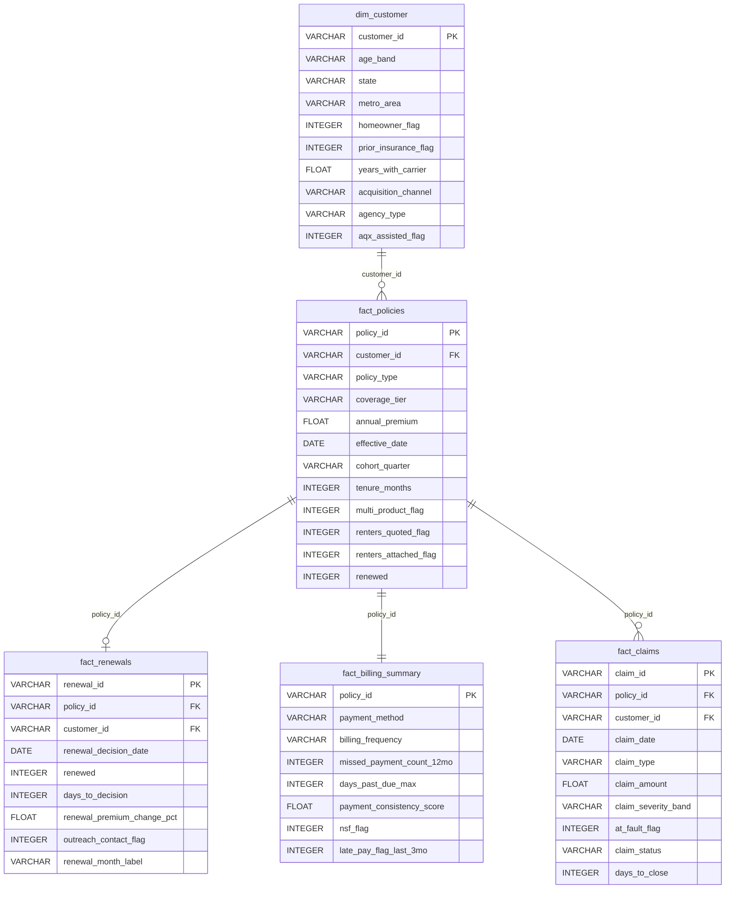

# Waypoint Property & Casualty -- Entity Relationship Diagram

**Project:** waypoint-retention-analytics
**Author:** Luciano Casillas
**Date:** 2026-05-02
**Schema:** WAYPOINT_ANALYTICS

---

## Relationships

| Parent Table | Child Table | Join Key | Cardinality |
|---|---|---|---|
| dim_customer | fact_policies | customer_id | 1 to many |
| fact_policies | fact_renewals | policy_id | 1 to 0-or-1 |
| fact_policies | fact_billing_summary | policy_id | 1 to 1 |
| fact_policies | fact_claims | policy_id | 1 to many |

---

## Mermaid Diagram

---

## Notes

- **fact_billing_summary** is a strict 1-to-1 extension of fact_policies. Every policy has exactly one billing summary row.
- **fact_renewals** only covers policies with a known renewal outcome (~72,000 rows). Policies effective after 2024-12-31 do not have a renewal row.
- **fact_claims** is sparse. Only ~21% of policies have at least one claim row.
- **customer_id** is denormalized onto fact_renewals and fact_claims for query convenience. The authoritative source is dim_customer.
- Snowflake does not enforce FOREIGN KEY constraints at runtime, but all FKs are declared for documentation and lineage purposes.
